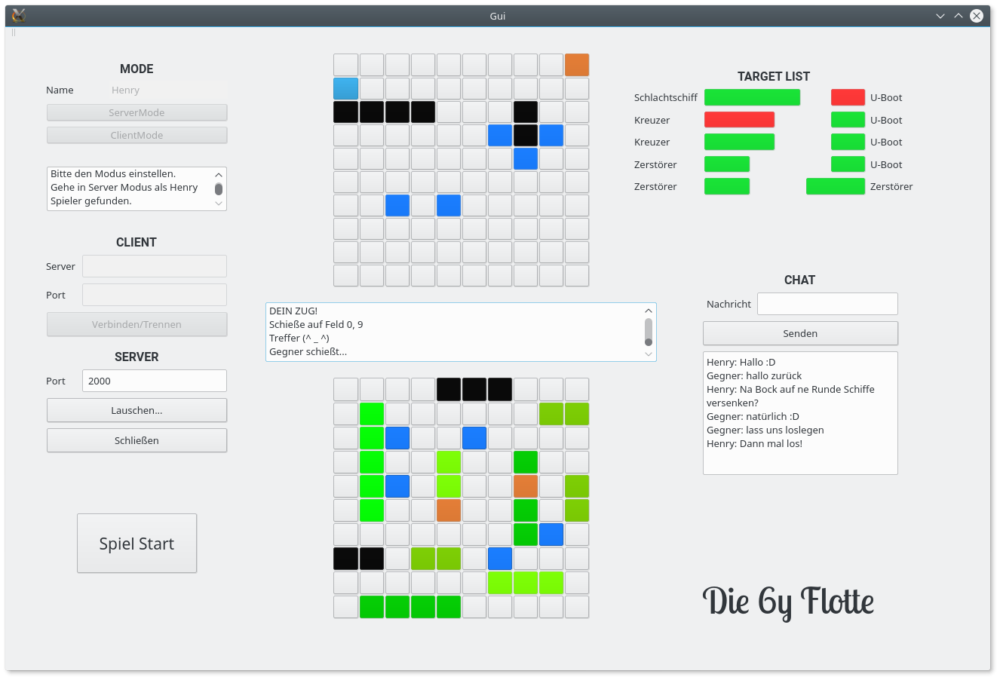

# Die 6y Flotte

Die 6y Flotte is a C++ based implementation of the classic Game [Battleship](https://de.wikipedia.org/wiki/Schiffe_versenken). It features a GUI written in QT5 and online playing capabilities.


## Getting Started

These instructions will get you a copy of the project up and running on your local machine for development and testing purposes.

### Installing

You will need [QT Creator](https://www.qt.io/download) to build a playable Application Window on your chosen OS.

## How to play

### Find an opponent

Select if you want to start the game as Server or Client by clicking either the **ServerMode** or **ClientMode** button.

* **ServerMode**: Enter port number in the port field and click on *lauschen*
* **ClientMode**: Enter IP address and port number of the server you want to connect with.

```
IP address: localhost
Port: 1234
```
Set your ships by clicking the desired button in the bottom matchboard.
Hit **Spiel Start** to start the game.

### Start to sink those sheeeps!

Click fields on the top matchboard you want to shoot!

## Built With

* [C++](http://www.dropwizard.io/1.0.2/docs/) - Used for backend
* [QT5](https://www.qt.io/) - The GUI and TCP toolkit used


## Authors

* **Henry He** - *Logic*
* **Arber Salihu** - *Network*
* **Niklas Schwarz** - *GUI*


## Acknowledgments

* This project is part of the course [Blockpraktikum C++](https://www.sec.ei.tum.de/lehrveranstaltungen/blockpraktikum-c/) offered by the Chair of Security in Information Technology at the Technical University of Munich.
* We want to thank everyone responsible for this course giving us the opportunity to learn an object oriented programming language.
